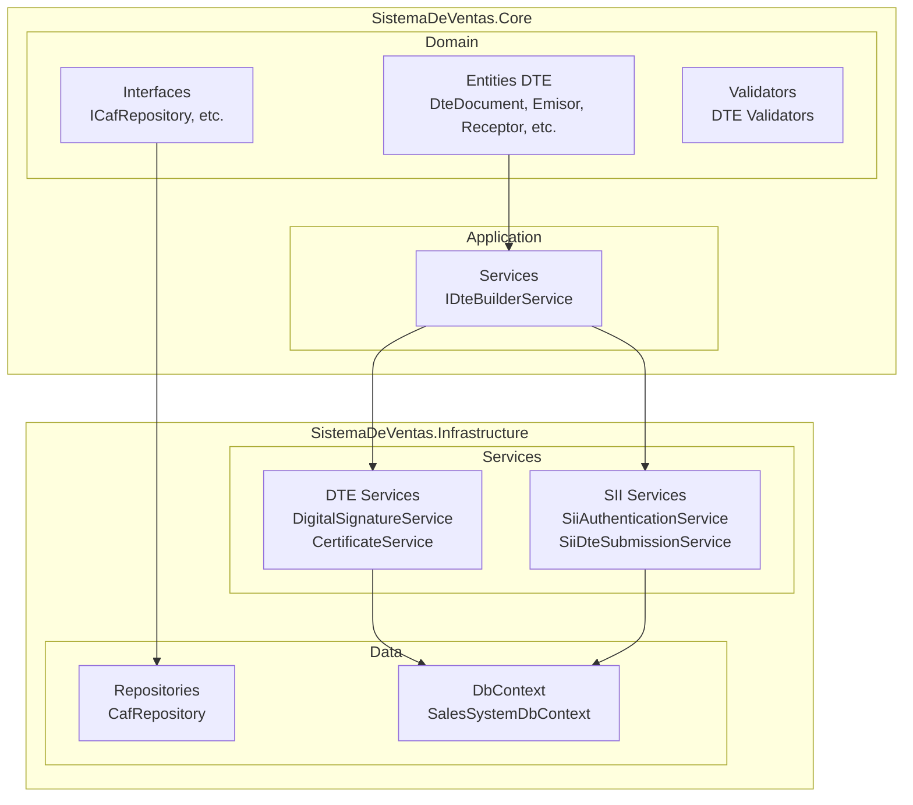
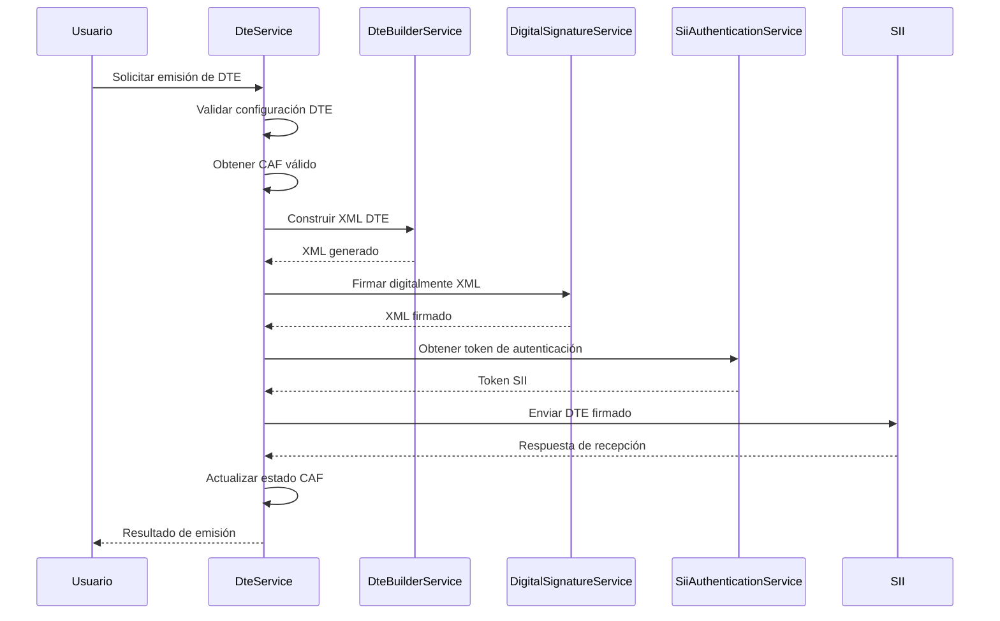

# Documentación DTE - SistemaDeVentas

Esta documentación describe el proceso de migración y uso de Documentos Tributarios Electrónicos (DTE) en el sistema SistemaDeVentas, incluyendo la implementación completa de la funcionalidad DTE compatible con el Servicio de Impuestos Internos (SII) de Chile.

## Tabla de Contenidos

- [Introducción](#introducción)
- [Arquitectura del Sistema DTE](#arquitectura-del-sistema-dte)
- [Flujo de Trabajo DTE](#flujo-de-trabajo-dte)
- [Guía de Instalación y Configuración](#guía-de-instalación-y-configuración)
- [Uso de la API](#uso-de-la-api)
- [Ejemplos de Código](#ejemplos-de-código)
- [Manejo de Errores](#manejo-de-errores)
- [Comparación con LibreDTE](#comparación-con-libredte)

## Introducción

El módulo DTE de SistemaDeVentas permite la emisión, firma digital y envío de documentos tributarios electrónicos al SII de Chile. La implementación está basada en las especificaciones técnicas del SII y es compatible con los estándares XML-DSig para firma digital.

### Características Principales

- **Compatibilidad SII**: Implementación completa de los esquemas XML del SII
- **Firma Digital**: Soporte para certificados PKCS#12 con algoritmos RSA-SHA256
- **Gestión CAF**: Manejo automático de Códigos de Autorización de Folios
- **Validación**: Validación de esquemas XML y reglas de negocio
- **Autenticación SII**: Integración con servicios de autenticación del SII
- **Arquitectura Limpia**: Separación de responsabilidades con patrón CQRS y Dependency Injection

## Arquitectura del Sistema DTE

La arquitectura del módulo DTE sigue los principios de Domain-Driven Design (DDD) y Clean Architecture, organizada en capas claramente definidas.



### Capas de la Arquitectura

- **Domain**: Contiene las entidades de negocio, interfaces y lógica de validación
- **Application**: Servicios de aplicación que orquestan las operaciones DTE
- **Infrastructure**: Implementaciones concretas de servicios externos (firma, SII, base de datos)

## Flujo de Trabajo DTE

El proceso completo de emisión de un DTE involucra varios pasos secuenciales desde la creación hasta el envío al SII.



### Pasos del Flujo

1. **Configuración**: Validación de settings DTE y certificado digital
2. **CAF Management**: Obtención de folio válido desde CAF activo
3. **Construcción XML**: Generación del documento XML según esquemas SII
4. **Firma Digital**: Aplicación de firma XML-DSig con certificado PKCS#12
5. **Autenticación SII**: Obtención de token usando semilla y firma
6. **Envío**: Subida del DTE al servicio de recepción del SII
7. **Actualización**: Registro del folio utilizado y estado del envío

## Guía de Instalación y Configuración

### Prerrequisitos

- .NET 6.0 o superior
- Certificado digital PKCS#12 válido emitido por autoridad certificadora reconocida por el SII
- CAF (Código de Autorización de Folios) obtenido desde el portal del SII
- Conexión a base de datos SQL Server

### Instalación de Dependencias

```bash
# Instalar paquetes NuGet necesarios
dotnet add package BouncyCastle.NetCore
dotnet add package System.Security.Cryptography.Xml
dotnet add package Microsoft.EntityFrameworkCore.SqlServer
```

### Configuración Inicial

1. **Configurar DteSettings**:

```csharp
var dteSettings = new DteSettings
{
    Ambiente = 0, // 0 = Certificación, 1 = Producción
    RutEmisor = "12345678-9",
    CertificadoRuta = @"C:\certificados\certificado.p12",
    CertificadoPassword = "password_certificado",
    CafDirectory = @"C:\caf\",
    ServicioTimbradoUrl = "https://palena.sii.cl/DTEWS/CrSeed.jws",
    TimeoutSegundos = 30
};

// Validar configuración
var errores = dteSettings.Validar();
if (errores.Any())
{
    throw new InvalidOperationException($"Errores de configuración: {string.Join(", ", errores)}");
}
```

2. **Registrar Servicios en DI**:

```csharp
services.AddScoped<IDteBuilderService, DteBuilderService>();
services.AddScoped<IDigitalSignatureService, DigitalSignatureService>();
services.AddScoped<ICertificateService, CertificateService>();
services.AddScoped<ISiiAuthenticationService, SiiAuthenticationService>();
services.AddScoped<ICafRepository, CafRepository>();
```

3. **Configurar Base de Datos**:

```sql
-- Crear tabla para CAF
CREATE TABLE Caf (
    Id INT PRIMARY KEY IDENTITY,
    TipoDocumento INT NOT NULL,
    FolioDesde INT NOT NULL,
    FolioHasta INT NOT NULL,
    FechaAutorizacion DATETIME NOT NULL,
    FechaVencimiento DATETIME NOT NULL,
    XmlContent NVARCHAR(MAX) NOT NULL,
    Ambiente INT NOT NULL,
    RutEmisor NVARCHAR(12) NOT NULL,
    FolioActual INT DEFAULT 0,
    Activo BIT DEFAULT 1
);

-- Crear tabla para certificados
CREATE TABLE CertificateData (
    Id INT PRIMARY KEY IDENTITY,
    Nombre NVARCHAR(255) NOT NULL,
    RutEmisor NVARCHAR(12) NOT NULL,
    Ambiente INT NOT NULL,
    DatosCertificado VARBINARY(MAX) NOT NULL,
    PasswordEncriptado NVARCHAR(255) NOT NULL,
    FechaEmision DATETIME NOT NULL,
    FechaVencimiento DATETIME NOT NULL,
    Activo BIT DEFAULT 1
);
```

4. **Cargar CAF Inicial**:

```csharp
var caf = new Caf();
caf.CargarDesdeXml(xmlCafContent);
await _cafRepository.GuardarAsync(caf);
```

## Uso de la API

### Interfaces Principales

#### IDteBuilderService

```csharp
public interface IDteBuilderService
{
    XDocument BuildXml(DteDocument dteDocument);
    bool ValidateXml(XDocument xmlDocument);
}
```

#### IDigitalSignatureService

```csharp
public interface IDigitalSignatureService
{
    XDocument SignXmlDocument(XDocument xmlDocument, X509Certificate2 certificate);
    bool VerifyXmlSignature(XDocument xmlDocument);
    string SignDataWithRsaSha256(string data, X509Certificate2 certificate);
}
```

#### ICertificateService

```csharp
public interface ICertificateService
{
    X509Certificate2 LoadCertificateFromFile(string filePath, string password);
    bool ValidateCertificateForSigning(X509Certificate2 certificate);
    RSA GetPrivateKey(X509Certificate2 certificate);
}
```

#### ISiiAuthenticationService

```csharp
public interface ISiiAuthenticationService
{
    Task<string> GetSeedAsync(int ambiente = 0);
    Task<string> GetTokenAsync(string signedSeedXml, int ambiente = 0);
}
```

### Servicio Principal de DTE

```csharp
public class DteService
{
    private readonly IDteBuilderService _builderService;
    private readonly IDigitalSignatureService _signatureService;
    private readonly ICertificateService _certificateService;
    private readonly ISiiAuthenticationService _authService;
    private readonly ICafRepository _cafRepository;
    private readonly DteSettings _settings;

    public async Task<DteResult> EmitirDteAsync(DteDocument document)
    {
        // 1. Validar configuración
        var errores = _settings.Validar();
        if (errores.Any()) throw new DteValidationException(string.Join(", ", errores));

        // 2. Obtener CAF válido
        var caf = await _cafRepository.ObtenerPorTipoDocumentoAsync(
            (int)document.IdDoc.TipoDTE, _settings.Ambiente, _settings.RutEmisor);
        if (caf == null) throw new InvalidOperationException("No hay CAF válido disponible");

        // 3. Asignar folio
        document.IdDoc.Folio = caf.ObtenerSiguienteFolio();

        // 4. Construir XML
        var xmlDocument = _builderService.BuildXml(document);

        // 5. Cargar certificado
        var certificate = _certificateService.LoadCertificateFromFile(
            _settings.CertificadoRuta, _settings.CertificadoPassword);

        // 6. Firmar XML
        var signedXml = _signatureService.SignXmlDocument(xmlDocument, certificate);

        // 7. Obtener token SII
        var seed = await _authService.GetSeedAsync(_settings.Ambiente);
        var signedSeed = _signatureService.SignDataWithRsaSha256(seed, certificate);
        var token = await _authService.GetTokenAsync(signedSeed, _settings.Ambiente);

        // 8. Enviar al SII (implementación simplificada)
        var envioResult = await EnviarAlSiiAsync(signedXml, token);

        // 9. Actualizar CAF
        await _cafRepository.ActualizarFolioActualAsync(caf.Id, document.IdDoc.Folio);

        return new DteResult
        {
            Folio = document.IdDoc.Folio,
            XmlFirmado = signedXml.ToString(),
            TrackId = envioResult.TrackId,
            Estado = envioResult.Estado
        };
    }
}
```

## Ejemplos de Código

### Crear una Factura Afecta

```csharp
var factura = new DteDocument
{
    IdDoc = new IdDoc
    {
        TipoDTE = TipoDte.FacturaAfecta,
        FechaEmision = DateTime.Now,
        FechaVencimiento = DateTime.Now.AddDays(30),
        FormaPago = 1, // Contado
        IndicadorTraslado = 1 // Operación constituye venta
    },
    Emisor = new Emisor
    {
        RutEmisor = "12345678-9",
        RazonSocial = "Empresa Emisora S.A.",
        GiroEmisor = "Venta de productos tecnológicos",
        ActividadEconomica = 620900, // Servicios informáticos
        DireccionOrigen = "Av. Providencia 123",
        ComunaOrigen = "Providencia",
        CiudadOrigen = "Santiago",
        CorreoEmisor = "contacto@empresa.cl",
        Telefono = "+56912345678"
    },
    Receptor = new Receptor
    {
        RutReceptor = "98765432-1",
        RazonSocialReceptor = "Cliente S.A.",
        GiroReceptor = "Compra de productos",
        DireccionReceptor = "Calle Cliente 456",
        ComunaReceptor = "Las Condes",
        CiudadReceptor = "Santiago",
        CorreoReceptor = "cliente@cliente.cl"
    },
    Totales = new TotalesDte
    {
        MontoNeto = 100000,
        TasaIVA = 19,
        IVA = 19000,
        MontoTotal = 119000
    },
    Detalles = new List<DetalleDte>
    {
        new DetalleDte
        {
            NumeroLineaDetalle = 1,
            NombreItem = "Producto Afecto IVA",
            DescripcionItem = "Descripción detallada del producto",
            CantidadItem = 1,
            UnidadMedidaItem = "UN",
            PrecioItem = 119000,
            MontoItem = 119000,
            IndicadorExencion = 1 // No exento
        }
    }
};
```

### Crear una Boleta Electrónica

```csharp
var boleta = new DteDocument
{
    IdDoc = new IdDoc
    {
        TipoDTE = TipoDte.BoletaAfecta,
        FechaEmision = DateTime.Now
    },
    Emisor = new Emisor
    {
        RutEmisor = "12345678-9",
        RazonSocial = "Empresa Emisora S.A.",
        GiroEmisor = "Venta de productos"
    },
    Receptor = new Receptor(), // Boleta no requiere datos del receptor
    Totales = new TotalesDte
    {
        MontoNeto = 50000,
        TasaIVA = 19,
        IVA = 9500,
        MontoTotal = 59500
    },
    Detalles = new List<DetalleDte>
    {
        new DetalleDte
        {
            NumeroLineaDetalle = 1,
            NombreItem = "Servicio Profesional",
            CantidadItem = 1,
            PrecioItem = 59500,
            MontoItem = 59500
        }
    }
};
```

### Procesamiento por Lotes

```csharp
public async Task<List<DteResult>> ProcesarLoteDtesAsync(IEnumerable<DteDocument> documentos)
{
    var resultados = new List<DteResult>();

    foreach (var documento in documentos)
    {
        try
        {
            var resultado = await _dteService.EmitirDteAsync(documento);
            resultados.Add(resultado);
        }
        catch (Exception ex)
        {
            // Log error y continuar con siguiente documento
            _logger.LogError(ex, $"Error procesando DTE folio {documento.IdDoc.Folio}");
            resultados.Add(new DteResult
            {
                Error = ex.Message,
                Estado = "ERROR"
            });
        }
    }

    return resultados;
}
```

## Manejo de Errores

### Excepciones Específicas

```csharp
// Excepciones de dominio
public class DteValidationException : Exception
{
    public DteValidationException(string message) : base(message) { }
}

public class SiiCommunicationException : Exception
{
    public SiiCommunicationException(string message, Exception innerException)
        : base(message, innerException) { }
}

// Manejo de errores en el servicio
public async Task<DteResult> EmitirDteConManejoErroresAsync(DteDocument document)
{
    try
    {
        return await EmitirDteAsync(document);
    }
    catch (DteValidationException ex)
    {
        _logger.LogWarning(ex, "Error de validación DTE");
        return new DteResult { Estado = "VALIDATION_ERROR", Error = ex.Message };
    }
    catch (SiiCommunicationException ex)
    {
        _logger.LogError(ex, "Error de comunicación con SII");
        return new DteResult { Estado = "SII_ERROR", Error = ex.Message };
    }
    catch (CryptographicException ex)
    {
        _logger.LogError(ex, "Error de firma digital");
        return new DteResult { Estado = "SIGNATURE_ERROR", Error = ex.Message };
    }
    catch (Exception ex)
    {
        _logger.LogError(ex, "Error inesperado en emisión DTE");
        return new DteResult { Estado = "UNKNOWN_ERROR", Error = ex.Message };
    }
}
```

### Códigos de Error Comunes

| Código | Descripción | Solución |
|--------|-------------|----------|
| `VAL-001` | RUT emisor inválido | Verificar formato RUT (XX.XXX.XXX-X) |
| `VAL-002` | Certificado expirado | Renovar certificado digital |
| `VAL-003` | CAF no disponible | Solicitar nuevo CAF al SII |
| `SII-001` | Error de autenticación | Verificar credenciales y conexión |
| `SII-002` | XML mal formado | Validar esquema antes de envío |
| `SIG-001` | Error de firma | Verificar certificado y clave privada |

### Logging y Monitoreo

```csharp
public class DteLoggingMiddleware
{
    private readonly ILogger<DteLoggingMiddleware> _logger;

    public async Task InvokeAsync(DteDocument document, Func<Task<DteResult>> next)
    {
        _logger.LogInformation("Iniciando procesamiento DTE tipo {Tipo} folio {Folio}",
            document.IdDoc.TipoDTE, document.IdDoc.Folio);

        var stopwatch = Stopwatch.StartNew();
        try
        {
            var result = await next();
            stopwatch.Stop();

            _logger.LogInformation("DTE procesado exitosamente en {ElapsedMs}ms. TrackId: {TrackId}",
                stopwatch.ElapsedMilliseconds, result.TrackId);

            return result;
        }
        catch (Exception ex)
        {
            stopwatch.Stop();
            _logger.LogError(ex, "Error procesando DTE en {ElapsedMs}ms", stopwatch.ElapsedMilliseconds);
            throw;
        }
    }
}
```

## Comparación con LibreDTE

| Aspecto | SistemaDeVentas DTE | LibreDTE |
|---------|-------------------|-----------|
| **Lenguaje** | C# .NET | PHP |
| **Arquitectura** | DDD + Clean Architecture | MVC tradicional |
| **Firma Digital** | BouncyCastle + .NET Crypto | PHP OpenSSL |
| **Validación** | Esquemas XSD + reglas negocio | Validación básica |
| **Gestión CAF** | Automática con DB | Manual |
| **Autenticación SII** | SOAP completo | SOAP básico |
| **Testing** | xUnit + integración | PHPUnit limitado |
| **Documentación** | Completa en español | Inglés básico |
| **Mantenimiento** | Framework moderno | Legacy PHP |
| **Escalabilidad** | Alta (async/await) | Media |
| **Integración** | .NET ecosystem | PHP ecosystem |

### Ventajas de SistemaDeVentas DTE

- **Type Safety**: C# proporciona verificación de tipos en tiempo de compilación
- **Performance**: .NET ofrece mejor rendimiento para operaciones criptográficas
- **Testing**: Mejor soporte para pruebas unitarias e integración
- **Mantenibilidad**: Arquitectura limpia facilita evolución del código
- **Integración**: Fácil integración con sistemas empresariales .NET

### Consideraciones de Migración desde LibreDTE

1. **Cambio de Lenguaje**: Reescribir lógica de negocio de PHP a C#
2. **Adaptación de APIs**: Mapear llamadas SOAP existentes
3. **Gestión de Certificados**: Migrar almacenamiento y manejo de certificados
4. **Base de Datos**: Migrar estructura CAF y configuración
5. **Testing**: Reescribir tests usando xUnit

### Compatibilidad

El módulo DTE de SistemaDeVentas genera XML completamente compatible con los esquemas del SII, por lo que los DTE emitidos son indistinguibles de los generados por LibreDTE u otras soluciones.

---

*Documentación generada el 21 de septiembre de 2025*
*Versión del módulo DTE: 1.0.0*